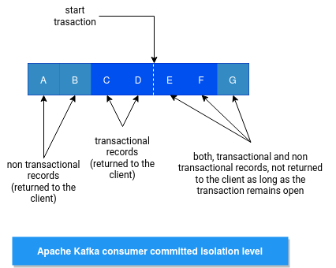

### Additional Notes
- Kafka utilizes `Zookeeper` for storing metadata information about the brokers, topics,
and partitions. Writes to Zookeeper are only performed on changes to the membership of consumer groups or on changes to the Kafka cluster itself.
- All the operations that modify the cluster state - create, delete and alter, are handled by the `Controller`. Operations that read the cluster state - list and describe,
can be handled by any broker and are directed to the least loaded broker (based
on what the client knows). This shouldn’t impact you as a user of the API, but it
can be good to know - in case you are seeing unexpected behavior, you notice
that some operations succeed while others fail, or if you are trying to figure out
why an operation is taking too long.
- At the time we are writing this chapter (Apache Kafka 2.5 is about to be released),
most admin operations can be performed either through AdminClient or directly
by modifying the cluster metadata in Zookeeper. We highly encourage you to
never use Zookeeper directly, and if you absolutely have to, report this as a bug to
Apache Kafka. The reason is that in the near future, the Apache Kafka community will remove the Zookeeper dependency,
and every application that uses Zookeeper directly for admin operations will have to be modified. The AdminClient
API on the other hand, will remain exactly the same, just with a different implementation inside the Kafka cluster.
- Also keep in mind that consumer groups don’t receive updates when offsets change in
the offset topic. They only read offsets when a consumer is assigned a new partition
or on startup
- Every broker in the cluster has a
MetadataCache that includes a map of all brokers and all replicas in the cluster
- partition= ( 1 Leader replica ) + ( * follower replica )
```
 in-sync replica :
A replica is considered in-sync if it is the leader for a partition, or if it is a follower
that:
• Has an active session with Zookeeper meaning, it sent a heartbeat to Zookeeper
in the last 6 seconds (configurable).
• Fetched messages from the leader in the last 10 seconds (configurable).
• Fetched the most recent messages from the leader in the last 10 seconds
```
- Each produced record has to be replicated to all in-sync replicas before it is available for consumers.
- How do the clients know where to send the requests? Kafka clients use another
request type called a metadata request, which includes a list of topics the client is
interested in. The server response specifies which partitions exist in the topics, the
replicas for each partition, and which replica is the leader. Metadata requests can be
sent to any broker because all brokers have a metadata cache that contains this information.
- - -

- transactions in kafka : Atomic multi-partition writes
- we have "commit marker" and "abort marker" as message in partitions with transactional messages , these markers will filter-out for consumers regardless of their isolation_level
-  As a result, applications reading from topics with transactional messages will see gaps in the consumed offsets


- read_committed consumer : by setting the isolation.level=read_committed in the consumer's configuration
```
LSO(Last Stable Offset) :
In read_committed mode, the consumer will read only those transactional messages which have been successfully committed.
It will continue to read non-transactional messages as before. 
There is no client-side buffering in read_committed mode. 
Instead, the end offset of a partition for a read_committed consumer would be the offset of the first message in the partition belonging to an open transaction. 
This offset is known as the 'Last Stable Offset'(LSO).
``` 
