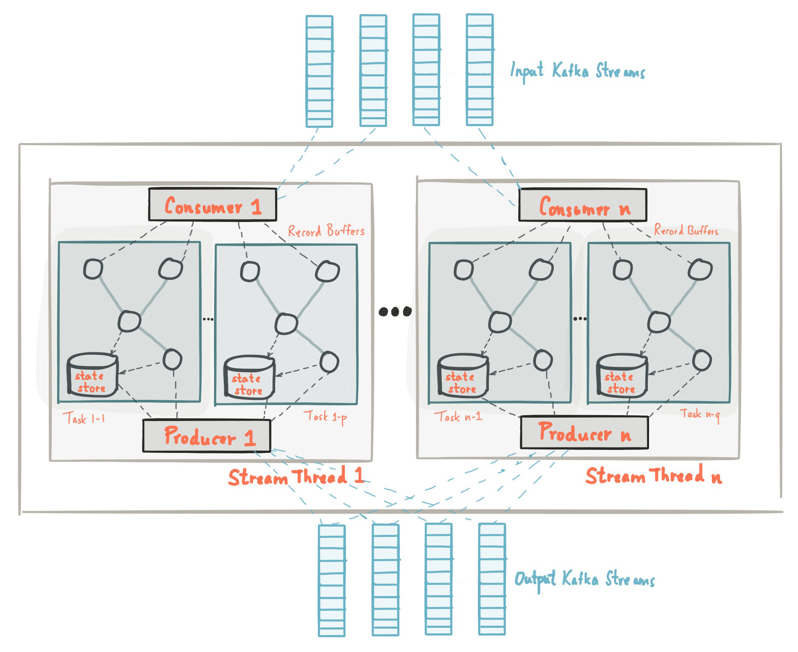
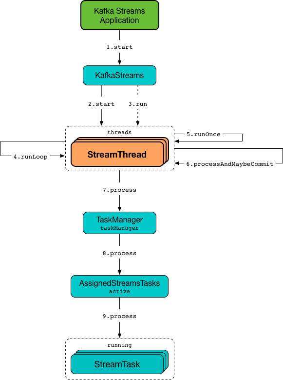

## kafka Stream application
- A normal path:
	- create StreamConfig obj
	- create Serde<T> obj
	- create StreamsBuilder instance
	- build your processing topology
	- create KafkaStreams obj
	```
	new KafkaStreams(StreamsBuilder#build(),StreamsConfig#);
	```
	- KafkaStreams#start();
	- KafkaStreams#close();
- - -
### Stream task: it's the smallest unit of work within a kafka streams. number of tasks is driven by the number of input partitions.
- streamTaskNumber=max(topic1InputPartions,topic?InputPartions...)
- each StreamTask has it's own state store .


## Tasks are assigned to StreamThread(s) for execution.
#

- By using Kafka topics to persist reshuffled streams instead of relying on interprocess communication directly,
  Kafka Streams effectively separates a single processor topology into smaller sub-topologies,
  connected by those repartition topics (each repartition topic is both a sink topic of the upstream sub-topology and a source topic of the downstream sub-topology).
  Sub-topologies can then be executed as independent stream tasks through parallel threads.
- - -
### In Kafka Streams, whenever you invoke a method that could result in generating a new key ( selectKey , map , or transform ), an internal Boolean flag is set to true , indicating that the new KStream instance requires repartitioning. With this Boolean flag set, if you perform a join, reduce, or aggregation operation, the repartitioning is handled for you automatically.
##### If you wanted to generate a new key/value pair or include the key in producing a new value, you’d use the KStream.map method that takes a KeyValueMapper<K, V, KeyValue<K1, V1>> instance.
